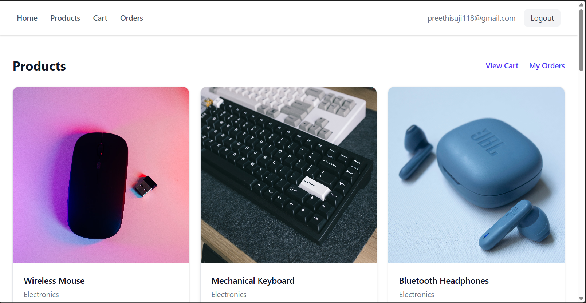
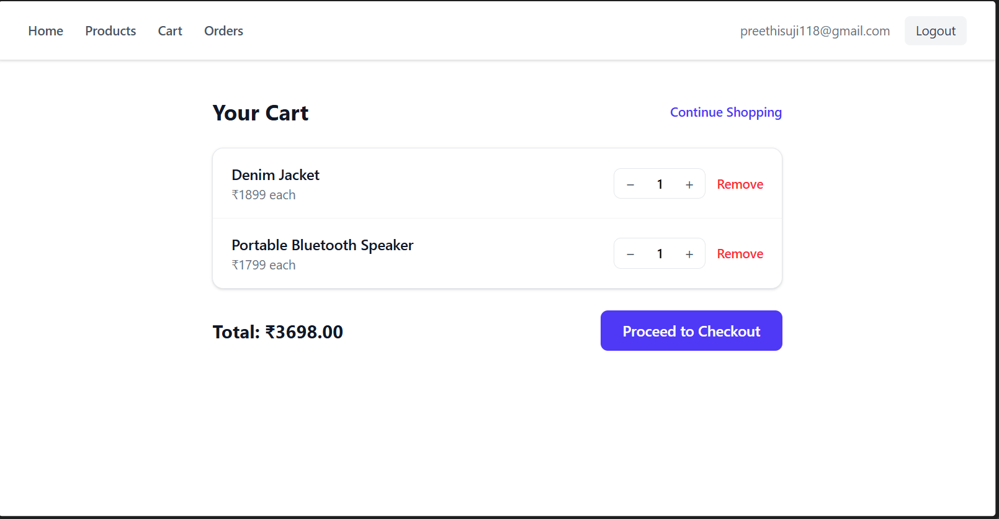
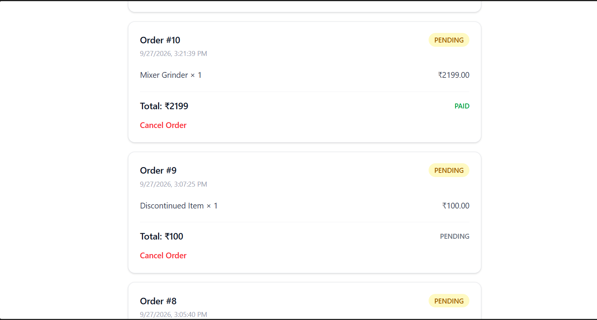
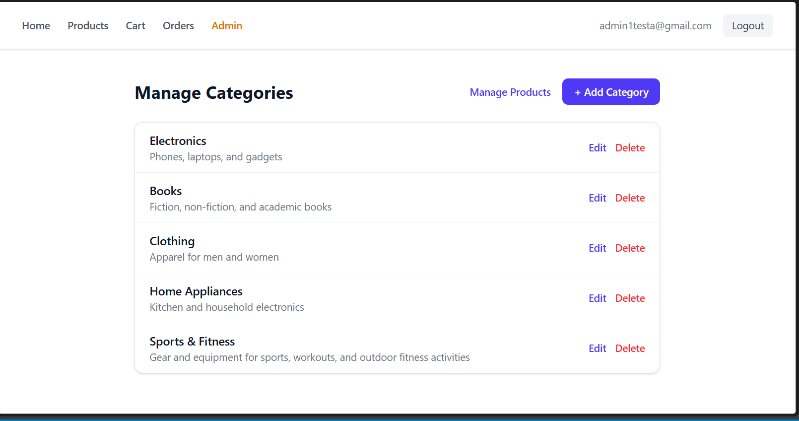

# E-Commerce Frontend

React frontend for the [E-Commerce Backend](https://github.com/preethi0207/ecommerce-backend), a Spring Boot REST API with JWT authentication.

## Tech Stack
- React (Vite)
- Redux Toolkit for state management
- Axios for API calls
- Razorpay Checkout for payments

## Features
- User registration and login (JWT)
- Product listing with stock status and out-of-stock handling
- Cart: add, update quantity, remove
- Checkout and Razorpay payment flow
- Order history
- Admin pages to manage products and categories

## Getting Started

1. Clone the repo
```
   git clone https://github.com/preethi0207/ecommerce-frontend.git
   cd ecommerce-frontend
```
2. Install dependencies
```
   npm install
```
3. Copy `.env.example` to `.env` and set your values
4. Start the backend (runs on port 8081)
5. Start the frontend
```
   npm run dev
```

## Screenshots
### Products



### Cart


### Orders


### Admin


## Backend
https://github.com/preethi0207/ecommerce-backend